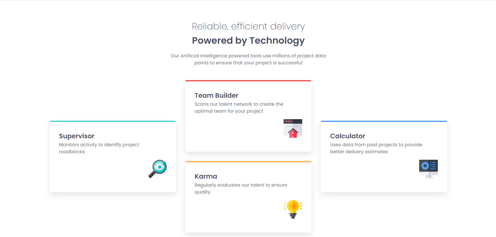
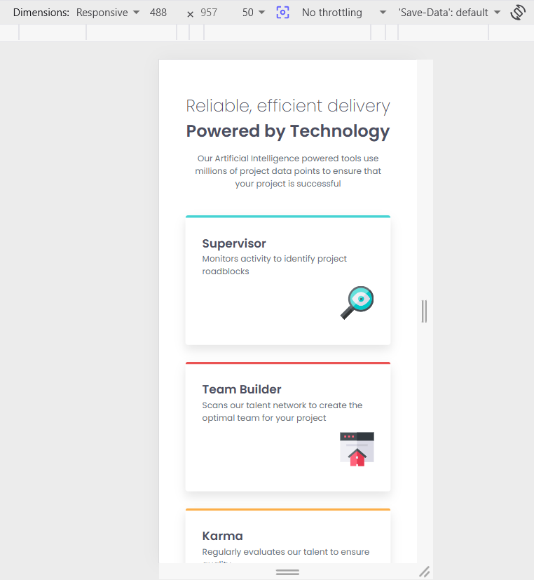

# Frontend Mentor - Four card feature section solution

This is a solution to the [Four card feature section challenge on Frontend Mentor](https://www.frontendmentor.io/challenges/four-card-feature-section-weK1eFYK). Frontend Mentor challenges help you improve your coding skills by building realistic projects. 

## Table of contents

- [Overview](#overview)
  - [The challenge](#the-challenge)
  - [Screenshot](#screenshot)
  - [Links](#links)
- [My process](#my-process)
  - [Built with](#built-with)
  - [What I learned](#what-i-learned)
  - [Continued development](#continued-development)
  - [AI Collaboration](#ai-collaboration)
- [Author](#author)
- [Acknowledgments](#acknowledgments)

## Overview

### The challenge

Users should be able to:

- View the optimal layout for the site depending on their device's screen size

### Screenshot

### Links

- Solution URL: (https://www.frontendmentor.io/solutions/responsive-four-card-feature-section-using-grid-and-flexbox-R_upqxtRZk)
- Live Site URL: (https://arceoche.github.io/Challenge6_Four-Card-Feature-Section/)

## My process

### Built with

- Semantic HTML5 markup
- CSS custom properties
- Flexbox
- CSS Grid
- Desktop-first workflow

### What I learned

In this challenge, I played around the media queries. I learned also how grid works, and how I could combine it with flexbox. Moreover, if you check my code, I did not put the 2 containers into one, but I feel like they would work still if I did so however I did not want to ruin anymore the project haha
### Continued development

I think it is the first time that I used 100% for the height. I actually was not confident that that would work, so I wanna be sure with that for future projects.

### AI Collaboration

I had a little help with ChatGPT, although I told it not to provide the solution.
## Author

- Frontend Mentor - [@arceoche](https://www.frontendmentor.io/profile/arceoche)
- Instagram - [@geminic.a](https://www.twitter.com/geminic.a)

## Acknowledgments

I'd like to give thanks to the creators of Frontend Mentor.
